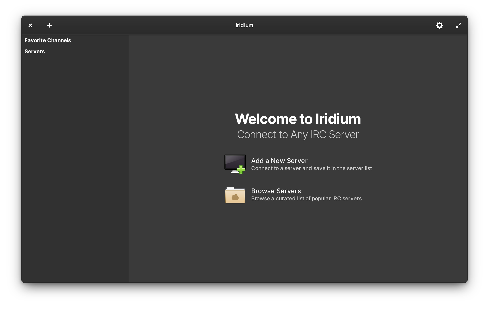
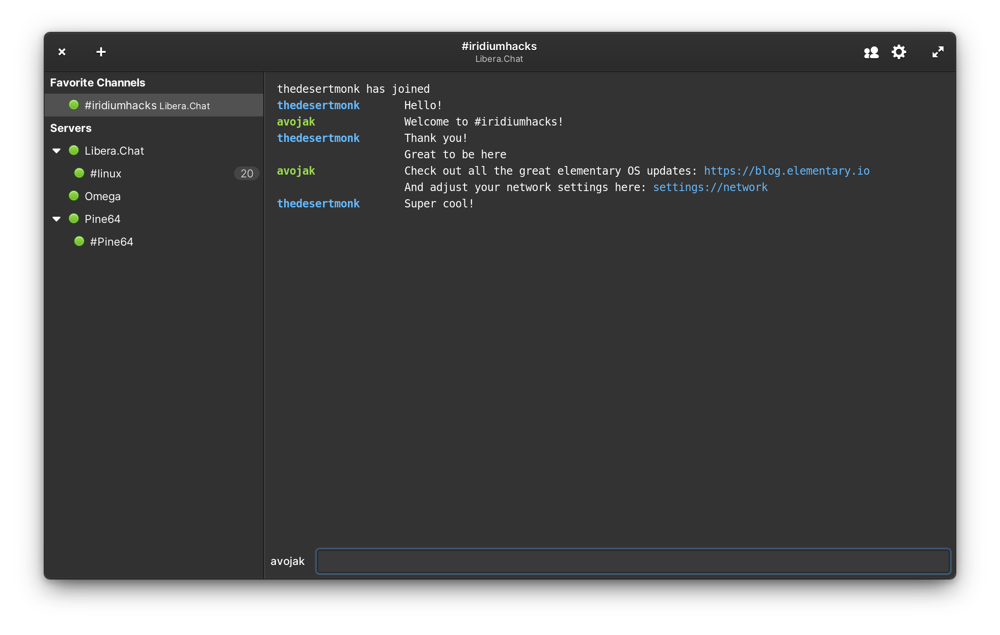
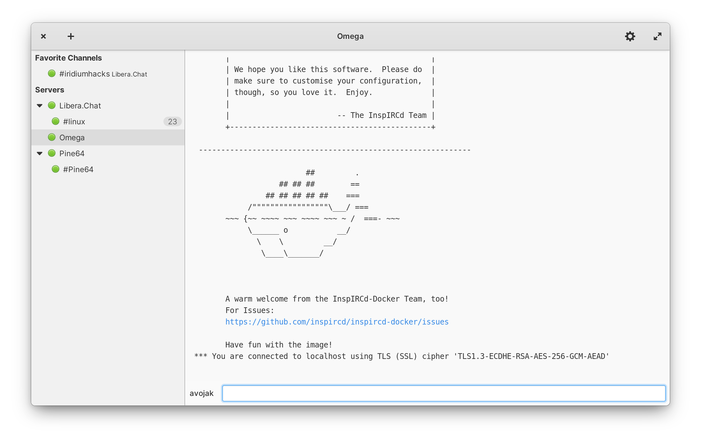
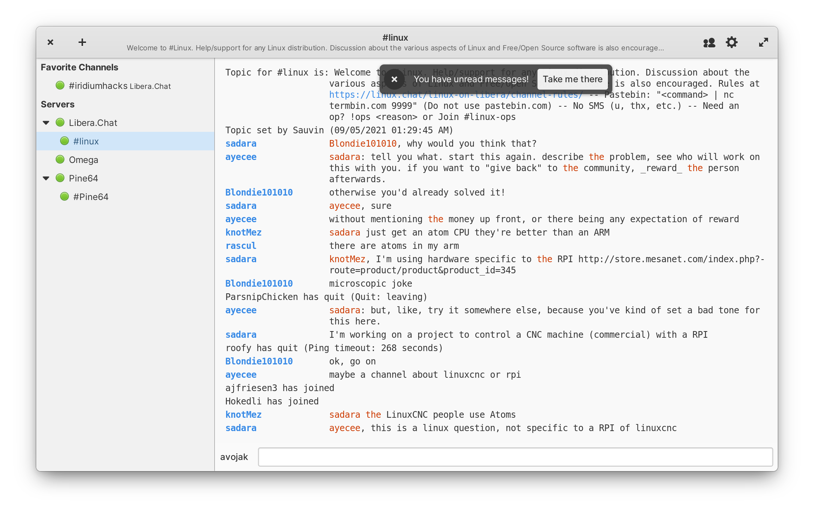

[](https://github.com/davisonio/awesome-irc)

<p align="center">
  
</p>
<h1 align="center">Iridium</h1>
<p align="center">
  <a href="https://appcenter.elementary.io/com.github.avojak.iridium"></a>
</p>

|  |  |
|------------------------------------------------------------------|------------------------------------------------------------------|
|  |  |

## The friendly IRC client

Iridium is a native Linux IRC client built in Vala and Gtk for [elementary OS](https://elementary.io).

## Install from Source

You can install Iridium by compiling from source. Here's the list of
dependencies required:

- `granite (>= 0.6.0)`
- `debhelper (>= 10.5.1)`
- `gettext`
- `libgtk-3-dev (>= 3.10)`
- `libgee-0.8-dev`
- `libsecret-1-dev`
- `libsqlite3-dev`
- `meson`
- `valac (>= 0.28.0)`
- `libsqlite3-dev`
- `libgtksourceview-4-dev`
- `libhandy-1-dev (>=1.0.0)`

An `install-dev-dependencies.sh` script is available to help developers get up and running.

## Building and Running

```bash
$ meson build --prefix=/usr
$ sudo ninja -C build install
$ com.github.avojak.iridium
```

### Flatpak

To test the Flatpak build with Flatpak Builder:

```bash
$ flatpak-builder build com.github.avojak.iridium.yml --user --install --force-clean
$ flatpak run --env=G_MESSAGES_DEBUG=all com.github.avojak.iridium
```

Another helpful environment variable to set is `GTK_DEBUG=interactive` for investigating UI and styling issues.

### Development Build

You can also install a development build alongside a stable version by specifying the dev profile:

```bash
$ meson build --prefix=/usr -Dprofile=dev
$ sudo ninja -C build install
$ G_MESSAGES_DEBUG=all com.github.avojak.iridium-dev
```

### Updating Translations

When new translatable strings are added, ensure that `po/POTFILES` contains a
reference to the file with the translatable string.

Update the `.pot` file which contains the translatable strings:

```bash
$ ninja -C build com.github.avojak.iridium-pot
```

Generate translations for the languages listed in the `po/LINGUAS` files:

```bash
$ ninja -C build com.github.avojak.iridium-update-po
```

### Testing

To facilitate testing, a `test-server.py` script is available which starts a local IRC server using Docker.

```bash
$ ./test-server.py [-h] {create|start|watch|stop|reset}
```

To create a new test server:

```bash
$ ./test-server.py create
```

You should now be able to connect to the server from Iridium using the Server `localhost`, and all other settings as default. (Note: If you have configured the settings to reject unacceptable SSL/TLS certificates, you may not be able to connect because the Docker IRC server uses self-signed certificates)

### Troubleshooting and Debugging

#### Logging

Log messages can be found using the `journalctl` command. For example, the following will show journal messages for the current boot of the OS:

```bash
$ journalctl -b
```

When the application starts, it logs a series of messages with basic information:

```
Jan 01 11:13:24 avojak-eOS plank.desktop[1992]: [INFO 11:13:24.802632] Application.vala:48: com.github.avojak.iridium-dev version: 1.0.0
Jan 01 11:13:24 avojak-eOS plank.desktop[1992]: [INFO 11:13:24.802666] Application.vala:49: Kernel version: 5.4.0-58-generic
Jan 01 11:13:24 avojak-eOS plank.desktop[1992]: [INFO 11:13:24.815561] SecretManager.vala:46: Secret schema version: 1
Jan 01 11:13:24 avojak-eOS plank.desktop[1992]: [INFO 11:13:24.850977] SQLClient.vala:39: Database file: iridium01.db
```

This can also be useful to locate where the application started amidst all of the journal entries.

#### Config Files

With Flatpak, application config files can be found in: `~/.var/app/com.github.avojak.iridium/`

## Project Status

This project is very much in-progress and has a lot of remaining work. Check out the [Projects](https://github.com/avojak/iridium/projects) page to track progress towards the next milestone.

Please keep in mind that at this time I am developing Iridium as a personal project in my limited free time to learn Vala and contribute back to the [elementary OS](https://elementary.io) community, so do not be offended if I reject a pull request or other contribution.

<p align="center"><a href="https://www.buymeacoffee.com/avojak" target="_blank"></a></p>
